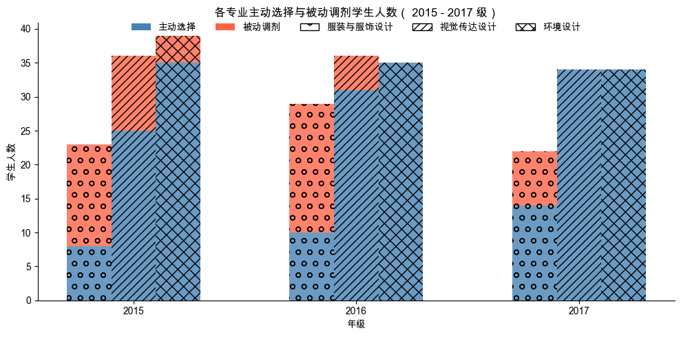
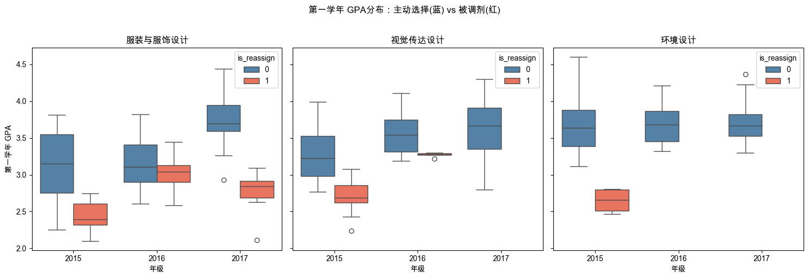

# 服装设计专业毕业率归因模型
基于 SQLite + Python 的教育数据分析项目，探查大类分流制度对服装专业毕业率的影响


## 1. 业务背景与任务 (Business Context&Task)
* **业务痛点：** 服装与服饰设计专业毕业率连续三年低于预期，2017 级毕业率已跌至 68%，学校就停止服装专业招收新生一事进行内部讨论。本项目旨在通过归因分析、定位核心流失环节，输出提升该专业学生毕业率的干预策略。
* **核心任务：** 输出结构化洞察，为教务干预提供数据支撑。
* **项目性质：** 真实落地项目。此次为项目重构，具体请参考   **7. 历史版本记录**


## 2. 核心洞察与商业价值 (Executive Summary)
* **洞察一：** 88% 的大类分流志愿集中在视传或环艺专业，服装专业成为调剂学生的主要去向。


* **洞察二：** 被动调剂学生第一学年 GPA 系统性地低于主动选择专业的学生，且差异达到统计显著水平。


* **洞察三：** 服装专业内部，学业基础与毕业率呈正相关趋势。

   | | 2014 级（无分流，对照组） | 2015-2017 级主动选择组 | 2015-2017 级被动调剂组 |
   | --: | :--: | :--: | :--: |
   | 第一学年 GPA 中位数 | 3.720 | 3.448 | 2.780 |
   | 四年正常毕业率 | 100% | 90.62% | 80.95% |


## 3. 完整分析报告 (Full Report)

详细的分析过程、图表和业务建议请参阅：
[服装设计专业毕业率归因模型 - Notion](https://www.notion.so/yuel/3207761aa52a80778bfbf14fbb50f8f6)

## 4. 数据集声明 (Data Origin)
* **数据来源：** 绩点数据由学校教务系统导出；分流志愿数据由学院教务办公室采集和归档。
* **时间跨度：** 2014-2023 年（2014-2017 级学生的在校时间，本科最长修读六年）。
* **数据体量：** ETL 阶段后的数据库文件 233 kb，涉及 367 位设计系学生。
* **隐私处理：** 数据库中的学生学号已经过 SHA-256 哈希脱敏处理，姓名字段已在 ETL 阶段删除。包含学生个人信息的原始表未上传。

## 5. 工程架构 (Repository Structure)
```
project_folder/
├── data/                                                 # 原始数据与中间表 (已加入 .gitignore)
│   ├── raw/                                                 # 原始数据 (含学生个人信息，不上传)
│   ├── stage/                                               # 中间表 (含学生个人信息，不上传)
│   └── processed/                                           # 清洗后数据库
│       └── art_school_reassign.db                              # 学号已哈希脱敏
├── docs/                                                 # 数据字典        
│   └── data_dictionary.md
├── notebooks/                                            # 用于探索性数据分析 (EDA) 的 Jupyter 文件
│   └── eda.ipynb
├── scripts/                                              # 数据处理与分析脚本 (SQL/R/Python)
│   ├── cleaning_data.py                                     # 数据清洗 ETL 脚本
│   ├── reassign_merge.py                                    # 分流志愿表格预处理脚本
│   └── special_student_check.py                             # 特殊学籍学生检查脚本
├── visuals/                                              # 核心可视化输出
│   ├── first_year_gpa_distribution.png                                   
│   └── student_size_volunteer_vs_reassign.png  
├── requirements.txt                                      # Python 依赖清单
└── README.md                                             # 项目说明书
```

## 6. 环境与复现指南 (Reproduction Guide)
**工具栈：**  Python 3.13 / SQLite
**核心库：**  Pandas · SQLAlchemy · Seaborn · SciPy
**复现步骤：**
1. 克隆本项目仓库：
   `https://github.com/uvwyueling/art_school_with_low_graduation_rate`
2. 安装依赖环境：
   * Python 依赖包安装：在终端执行 `pip install -r requirements.txt`

3. 执行数据清洗与分析：
   1. 运行 `scripts/reassign_merge.py`            合并三年的志愿填报表格
   2. 运行 `scripts/special_student_check.py`     特殊学生情况查勘（ ⚠️ 运行后需手工补全 to_verify_17students.csv）
   3. 运行 `scripts/cleaning_data.py`             执行 ETL 流程
   4. 运行 `notebooks/eda.ipynb`                  深入数据探查


## 7. 历史版本记录  (Version History)
| 评估维度 | V1.0 (2021) | V2.0 (重构版) | 效率增益/优化点 |
| :--: | :-- | :-- | :-- |
| 数据流管线 | 手动 Excel 拼表 | SQLite 关系型存储 + Python 自动化读取 | 消除人工复制粘贴造成的脏数据风险，实现数据与分析代码分离 |
| 异常处理 | 无 (保留异常量纲) | Pandas 预处理 | 修正异构数据对比的逻辑谬误，确保趋势判断的数学严谨性 |
| 假设检验 | 肉眼观察图表趋势 | 引入显著性检验(U 检验)判断成绩分布 | 从“主观相关性猜测”升级为“统计学显著性证明” |
| 可视化呈现 | RawGraphs 静态输出 | Seaborn 和 matplotlib 代码化生成 | 统一样式规范，实现图表生成的可复现性 |


